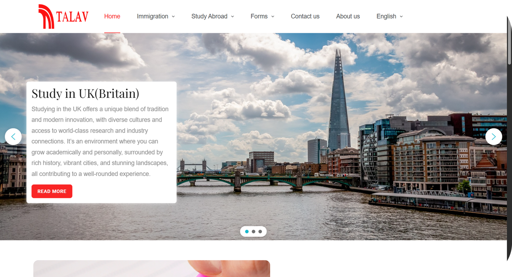
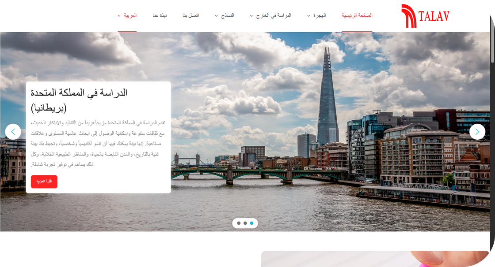
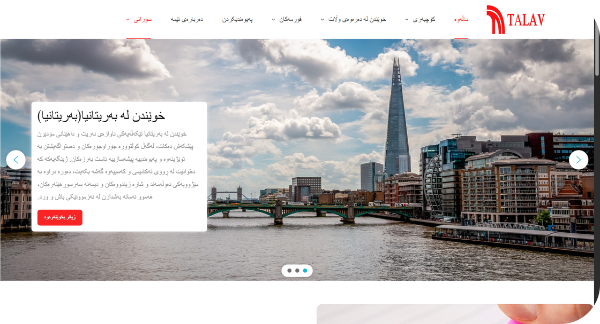

# 🌍 TalavImmigration Platform

**TalavImmigration** is a platform designed to simplify travel and immigration processes for Kurdish community and international travelers.  
The platform consolidates fragmented services into a single, user-friendly solution that bridges the gap between complex immigration procedures, study abroad opportunities and real-time travel information.

🌐 **Website Live:** [talavimmigration.com](https://talavimmigration.com)
---

## ✨ What TalavImmigration Solves
- **Fragmented Services** → Centralizes booking, visa and immigration resources in one place  
- **Complex Processes** → Streamlines overwhelming immigration and study abroad procedures  
- **Information Gaps** → Provides up-to-date, reliable guidance for multiple countries  
- **Language Barriers** → Bilingual support (English & Kurdish) for broader accessibility  

---

## 🚀 Core Features
### 🏠 Comprehensive Information Hub
- Immigration pathways for **USA, UK, Canada, Australia, Germany, Netherlands, Austria, France**  
- Study abroad resources with detailed educational requirements  
- Multi-pathway coverage: education, investment, permanent residency and asylum  

### 📋 Intelligent Form Management
- TalavImmigration Main Form for personalized consultation requests  
- Online appointment booking with date selection  
- Bilingual forms 
- Automated data collection integrated with admin panel  

### 🌐 User-Centric Design
- **Fully Responsive** → Works smoothly across mobile, tablet, laptop, desktop and even smart TVs  
- step-by-step navigation for a smooth user journey  
- Visual enhancements with professional imagery & interactive elements  
- Real-time updates on immigration laws & travel policies  

### 📍 Integrated Services
- Contact management with embedded Google Maps  
- Transparent “About Us” section with company & team details  
- Social media integration for stronger community presence  

---

## 🛠️ Technical Excellence
- **WordPress-based architecture** for scalability & reliability  
- **Plugin integrations** for advanced functionality  
- **Performance optimization** to ensure fast load times  
- **Security-first design** with strong form protection  
- **Automated workflows** for smooth form & data processing  
- **SEO optimization** for better visibility  
- **Backup systems** to ensure data safety  

---

## 📊 Impact & Benefits
### For Users
- 70% reduction in research time  
- Increased accuracy with automated form validation  
- Bilingual support expands accessibility
- One-stop platform eliminates need for multiple services  
- Access from **any device, anytime, anywhere**  

### For Service Providers
- Simplified client management through centralized data  
- Improved efficiency with automation  
- Enhanced online presence & credibility  
- Expanded digital reach  

---

## 💡 Unique Value Proposition
- **Cultural Sensitivity** → Tailored for the Kurdish community  
- **Comprehensive Coverage** → End-to-end travel & immigration solution  
- **Bilingual Accessibility** → English & Kurdish support  
- **Real-world Focus** → Practical, actionable guidance  
- **Community-Centric** → Built by and for the people it serves  

---

## 📈 Success Metrics
- **User Satisfaction** → Positive feedback & higher engagement rates  
- **Technical Performance** → Optimized speed & stability  
- **Business Impact** → Streamlined operations, better client retention  
- **Scalability** → Designed to expand with demand  

---

## 🔮 Future Roadmap
- Expansion to additional countries  
- AI-powered assistance & personalized recommendations  
- Native mobile applications (iOS & Android)  
- Partnerships with travel agencies & service providers  
- Community building through user forums & support networks  

---

## 🏗️ Professional Development
- **Academic Foundation** → Research-based solutions  
- **Industry Standards** → Built with modern web practices  
- **User-Centered Design** → Prioritizes real user needs  
- **Quality Assurance** → Tested for performance, security and reliability  

---

### 📌 About
TalavImmigration represents a **future-ready immigration and travel platform**, combining cultural understanding with modern technology to serve the needs of individuals seeking opportunities abroad.  
Its responsive design ensures accessibility across all devices such as mobile, tablet, laptop and smart TV, provides a smooth experience for every user.

---

## UI Preview

|home page english 1 🔽|
|:---------------:|
||

|home page arabic 3 🔽|
|:---------------:|
||

|home page kurdish 4 🔽|
|:---------------:|
||

  

---
> **Repository created on:** 2025-09-13, 06:08 (UTC+3)
